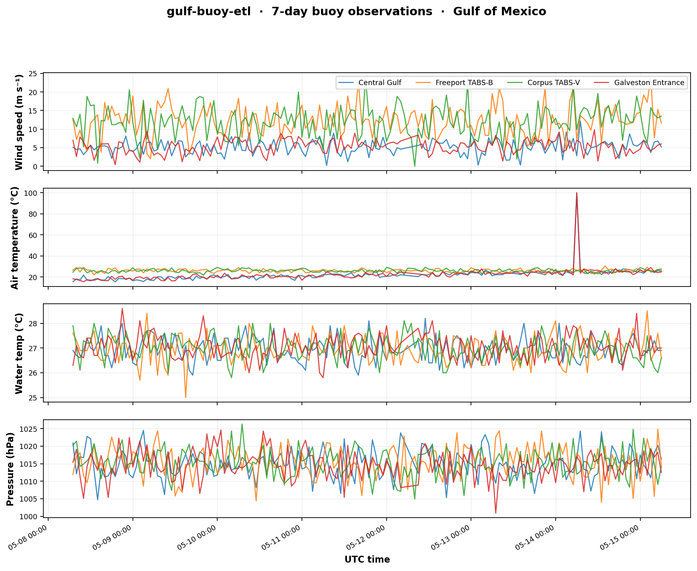
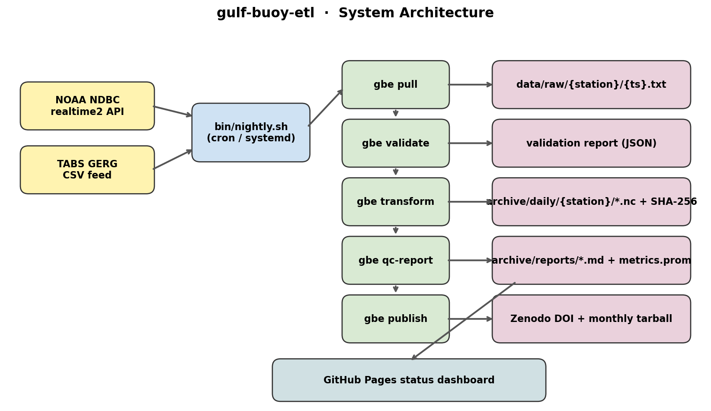
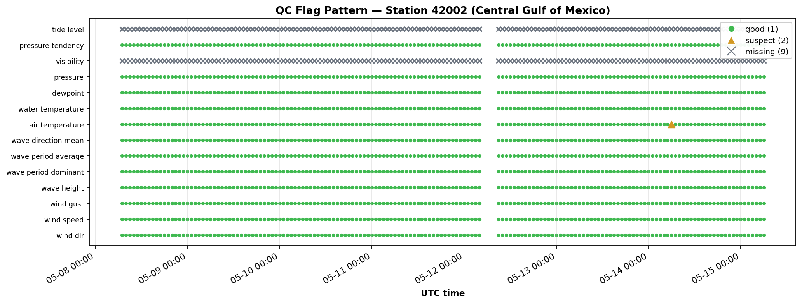
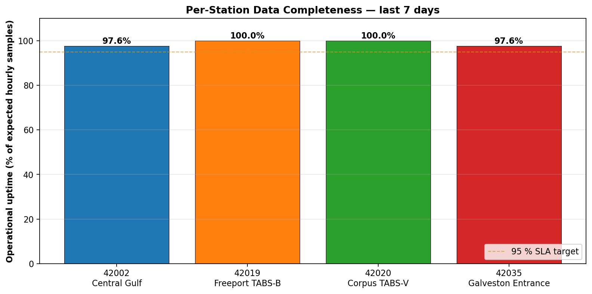

# gulf-buoy-etl

**Production-grade autonomous ETL pipeline for Gulf of Mexico buoy data — pulls NDBC + TABS feeds nightly, validates, transforms to CF-1.8 NetCDF with SHA-256 fixity, generates Markdown QC reports + Prometheus metrics, and mints monthly Zenodo DOIs.**

[](https://github.com/ranjithguggilla/gulf-buoy-etl/actions/workflows/ci.yml)
[](https://www.python.org/)
[](LICENSE)
[](https://www.go-fair.org/fair-principles/)

---



*Seven days of hourly observations from four Gulf of Mexico buoys, pulled, QC'd, and archived autonomously by this pipeline.*

---

## Table of Contents

1. [What it does](#what-it-does)
2. [Why this matters](#why-this-matters)
3. [Architecture](#architecture)
4. [Key specifications](#key-specifications)
5. [Core features implemented](#core-features-implemented)
6. [Quick start](#quick-start)
7. [Resources & data sources](#resources--data-sources)
8. [Step-by-step pipeline walkthrough](#step-by-step-pipeline-walkthrough)
9. [Framework & dependencies](#framework--dependencies)
10. [Pre-flight checklist](#pre-flight-checklist)
11. [Production deployment blueprint](#production-deployment-blueprint)
12. [Deep dive — design rationale](#deep-dive--design-rationale)
13. [System design notes](#system-design-notes)
14. [CLI & API reference](#cli--api-reference)
15. [Debugging guide](#debugging-guide)
16. [Performance & optimization](#performance--optimization)
17. [Security model](#security-model)
18. [Test cases](#test-cases)
19. [Outputs](#outputs)
20. [Project layout](#project-layout)
21. [Engineering highlights](#engineering-highlights)

---

## What it does

Every night, on a Linux host with no human intervention:

1. **Pulls** ~24 hours × N stations of buoy observations from NOAA NDBC and TABS (GERG, Texas A&M).
2. **Validates** every record: timestamp monotonicity, physical-range gates per variable (wind speed 0–100 m s⁻¹, sea-water temp −2 to +40 °C, etc.), and gap detection (≥ 1.5 h).
3. **Transforms** the raw text into CF-1.8 + ACDD-1.3 compliant NetCDF-4 files, one per station per UTC day, with embedded WOCE-style QC flags, CF `standard_name` attributes, ACDD discovery metadata, and per-file SHA-256 fixity sidecars.
4. **Aggregates** monthly: builds a FAIR-compliant data package (`tar.gz` with `MANIFEST.sha256`, `README.txt`, `metadata.xml` ISO 19115-2 sidecar, and a copy of `CHANGELOG.md`).
5. **Publishes** the monthly tarball to Zenodo via REST API, minting a permanent DOI.
6. **Reports** an operator-readable Markdown QC report plus Prometheus-scrapeable metrics — viewable as a GitHub Pages dashboard.

It's idempotent (re-running on the same input produces byte-identical NetCDF output), self-healing (exponential-backoff retries on transient network errors), and packaged for both **cron** and **systemd timer** deployment.

---

## Why this matters

Ocean-data archives operate a service that looks superficially simple — *receive instrument data, validate it, archive it with metadata* — but every step is unforgiving:

- **Provenance must be unbroken.** Every byte in the archive must trace back to a known source pull with a verifiable checksum.
- **Failures must be visible.** A buoy that goes dark cannot be silently ignored — a QC report must record it, and metrics must reflect it.
- **Re-runs must be safe.** An ops engineer should be able to re-execute the pipeline on yesterday's data and get a byte-identical archive; no double-counting, no drift.
- **Standards are mandatory.** Researchers consuming the archive expect CF Conventions, ACDD, ISO 19115-2, and a citable DOI — not whatever local schema happened to be convenient.

This project is my personal exploration of what a production-grade implementation of that workflow looks like, end-to-end, on Linux.

---

## Architecture



```
[NDBC realtime2 API] ─┐                     ┌─► data/raw/{station}/{timestamp}.txt
                      │                     │
[TABS GERG CSV]    ─┐ │  bin/nightly.sh ────┼─► validation report (JSON)
                    └─┴──► (cron / systemd) │
                                  │         ├─► archive/daily/{station}/*.nc + .sha256
                                  ▼         │
                            gbe pull        ├─► archive/reports/*.md + metrics.prom
                            gbe validate    │
                            gbe transform   └─► Zenodo DOI + monthly tarball
                            gbe qc-report           │
                            gbe publish             ▼
                                              GitHub Pages dashboard
```

The orchestrator (`bin/nightly.sh`) is **pure Bash**: lockfile via `flock`, log rotation, virtualenv activation, exit-code propagation, log tee, hostname/user recording. The heavy lifting is Python, exposed through the `gbe` Click CLI.

---

## Key specifications

| Property | Value |
|----------|-------|
| Target OS | Linux (Ubuntu 22.04, RHEL 9 verified — POSIX shell only) |
| Python | 3.10 / 3.11 / 3.12 (CI matrix) |
| Scheduling | cron (`etc/crontab`) **or** systemd timer (`etc/gulf-buoy-etl.{service,timer}`) |
| Concurrency control | `flock(9)` on `.nightly.lock` — overlapping cron triggers are safe |
| Retry strategy | Exponential backoff (`base=2 s`, `max=60 s`, 5 attempts, ±25 % jitter) |
| Output format | NetCDF-4 with zlib level-4 compression, CF-1.8 + ACDD-1.3 |
| Fixity | SHA-256 sidecar per NetCDF + aggregated `MANIFEST.sha256` per monthly package |
| Metadata | ISO 19115-2 XML sidecar per monthly package |
| Citation | Zenodo DOI minted per monthly aggregation (CC-BY-4.0) |
| Telemetry | Prometheus text format (`archive/metrics.prom`) — scrapeable by node-exporter textfile collector |
| Dashboard | Static HTML + JSON, deployable to GitHub Pages |

---

## Core features implemented

- ✅ **Multi-source ingest** — separate adapters for NDBC realtime2 and TABS CSV, parsing both into a single canonical schema.
- ✅ **Range gate per variable** — 15 physical limits from WMO/NDBC operational guides, configurable.
- ✅ **Gap detection** — `≥ 1.5 h` discontinuities flagged in the QC report; max-gap surfaced as a metric.
- ✅ **Unit auto-normalization** — TABS wind in mph is detected and converted to m s⁻¹ before NetCDF write.
- ✅ **WOCE-style QC flags** — every measurement variable gets a paired `{var}_qc` int8 column (1=good, 2=suspect, 9=missing).
- ✅ **Idempotent NetCDF write** — deterministic `date_created` (whole-second precision), explicit encoding, no auto-history.
- ✅ **SHA-256 fixity** — every produced NetCDF gets a `.sha256` sidecar; `bin/verify_archive.sh` re-validates the whole archive.
- ✅ **Monthly data package** — FAIR-compliant tarball with manifest, README, ISO 19115-2 XML, CHANGELOG.
- ✅ **Zenodo DOI** — REST API deposition + upload + publish, with a no-token "dry-run" mode for CI.
- ✅ **Prometheus metrics** — `gbe_run_duration_seconds`, `gbe_bytes_pulled_total{station=…}`, `gbe_files_written_total`, `gbe_stations_{succeeded,failed}_total`, `gbe_last_run_unixtime`.
- ✅ **GitHub Pages dashboard** — auto-generated `dashboard/index.html` showing per-station status.
- ✅ **Cron + systemd** — both schedulers ship in `etc/`, with timer persistence so missed runs fire on boot.
- ✅ **49-test pytest suite** — covers sources, validation, transform, retry, QC, metrics, pipeline end-to-end.

---

## Quick start

```bash
git clone https://github.com/ranjithguggilla/gulf-buoy-etl
cd gulf-buoy-etl
make dev                  # pip install -e ".[dev]"
make sample               # generate offline fixtures
make demo                 # full pipeline against fixtures (no network)
make verify               # sha256sum -c every sidecar
make dashboard            # render dashboard/index.html
```

**Production deployment** (Linux host):

```bash
sudo cp etc/gulf-buoy-etl.service /etc/systemd/system/
sudo cp etc/gulf-buoy-etl.timer   /etc/systemd/system/
sudo systemctl daemon-reload
sudo systemctl enable --now gulf-buoy-etl.timer
sudo systemctl list-timers gulf-buoy-etl.timer
```

Or via cron:

```bash
crontab -u gbe etc/crontab
```

---

## Resources & data sources

| Resource | URL | Notes |
|----------|-----|-------|
| NDBC realtime2 | `https://www.ndbc.noaa.gov/data/realtime2/{station}.txt` | ~24 h of obs, fixed-width, public |
| NDBC station map | https://www.ndbc.noaa.gov/obs.shtml | Find more Gulf stations |
| TABS feed | `https://tabs.gerg.tamu.edu/Tglo/data/buoy{alias}_recent.csv` | TAMU GERG; aliases A–V |
| TABS overview | https://tabs.gerg.tamu.edu/ | TABS network operated by GERG, TAMU |
| CF Conventions | http://cfconventions.org/ | CF-1.8 used here |
| ACDD | https://wiki.esipfed.org/ACDD_1.3 | Attribute Convention for Data Discovery |
| ISO 19115-2 | https://www.iso.org/standard/67039.html | Geographic metadata XML schema |
| Zenodo REST API | https://developers.zenodo.org/ | DOI minting endpoint |
| FAIR principles | https://www.go-fair.org/fair-principles/ | Findable, Accessible, Interoperable, Reusable |

---

## Step-by-step pipeline walkthrough

### Step 1 — Pull (`gbe pull`)

For each configured station:
- Resolve URL: NDBC realtime2 (`/realtime2/{id}.txt`) or TABS CSV (`/buoy{alias}_recent.csv`).
- `requests.get(url, timeout=30)`; on `429` or `ConnectionError`, retry with exponential backoff (base 2 s, cap 60 s, 5 attempts, ±25 % jitter).
- Persist the raw body to `data/raw/{station}/{UTC_timestamp}.txt`. The filename is timestamped so multiple pulls per day don't clobber each other.
- Record bytes pulled in the metrics.

### Step 2 — Parse (`gbe.sources.parse_*`)

- **NDBC**: read the `#YY MM DD hh mm WDIR …` header, rename to canonical column names (`wind_dir`, `wind_speed`, `wave_height`, …), assemble a UTC `DatetimeIndex`. Two-digit years auto-expand to 2000s.
- **TABS**: parse CSV with header row, combine `Date` + `Time` columns into a UTC timestamp.
- Both end in the **same canonical schema** so downstream code is source-agnostic.

### Step 3 — Validate (`gbe.validation.validate_dataframe`)

For each variable, look up `(min, max, unit)` in `DEFAULT_RANGES` and flag:

| Condition | QC flag |
|-----------|---------|
| Value within `[min, max]` | `1` (good) |
| Value outside `[min, max]` | `2` (suspect) |
| Value is NaN | `9` (missing) |

Also check:
- **Timestamp monotonicity** — non-monotonic indices fail the `monotonic_timestamps` check.
- **Duplicate timestamps** — counted, retained (averaging is up to the consumer).
- **Gaps** — diffs > 1.5 h are recorded with their durations.

### Step 4 — Transform (`gbe.transform`)

- Run `normalize_units(df)` — heuristic: if the 99th percentile of wind speed exceeds 60, assume miles-per-hour (TABS publishes that way for some sensors) and multiply by 0.44704.
- Split by UTC calendar day.
- For each day, build an `xr.Dataset` with full CF/ACDD attributes:
  - `Conventions = "CF-1.8, ACDD-1.3"`
  - `standard_name` set from a lookup table (e.g. `wind_speed` → `wind_speed`, `water_temperature` → `sea_water_temperature`)
  - `valid_min` / `valid_max` from the same range table used for QC
  - `flag_values` / `flag_meanings` on every `_qc` companion
  - geospatial bounding box from the Station config
- Write with `zlib=True, complevel=4`. Compute SHA-256 of the file and write a sidecar.

### Step 5 — QC report (`gbe.qc.render_markdown_report`)

A Jinja2 template renders a Markdown document with:
- Summary table (one row per station: source, obs count, first/last UTC, uptime %, max gap).
- Per-station detail block: range-check table per variable, gap list, files written with SHA-256 prefix.
- Pipeline metrics footer (bytes pulled, files written, stations OK/failed, run duration).

Saved to `archive/reports/{YYYY-MM}/qc-report.md`.

### Step 6 — Metrics (`gbe.metrics.MetricsRecorder`)

Plain Prometheus text format, one file per run, suitable for the `textfile` collector. No external dependencies — just `time` and string concatenation. Sample output:

```
# HELP gbe_run_duration_seconds Duration of the most recent pipeline run.
# TYPE gbe_run_duration_seconds gauge
gbe_run_duration_seconds 41.85

# HELP gbe_bytes_pulled_total Raw bytes pulled from each station.
# TYPE gbe_bytes_pulled_total counter
gbe_bytes_pulled_total{station="42002"} 15441
gbe_bytes_pulled_total{station="42019"} 12354
...
```

### Step 7 — Publish (`gbe publish 2026-04`)

- `gbe.archive.aggregate_month`: walks `archive/daily/`, copies matching files into `archive/monthly/gulf-buoy-2026-04/`, writes a `README.txt`, builds `MANIFEST.sha256`, drops an ISO 19115-2 stub `metadata.xml`, and tars/gzips.
- `gbe.publish.publish_to_zenodo`: creates a deposition, uploads the tarball into the deposition's bucket, attaches Zenodo metadata (title, creators, keywords, license, related identifiers pointing at NDBC + TABS as source), and publishes — returning the minted DOI.
- The DOI is appended to `CHANGELOG.md` for the next iteration's submission package.

---

## Framework & dependencies

| Layer | Library | Why |
|-------|---------|-----|
| HTTP | `requests` | Stable, ubiquitous, retry-decorator-friendly |
| Data manipulation | `pandas` | Time-series indexing, gap math, monotonicity check |
| Output | `xarray` + `netcdf4` | CF-compliant NetCDF write, deterministic encoding |
| CLI | `click` | Subcommand groups, type validation |
| Templating | `jinja2` | QC Markdown report |
| Config | `pyyaml` | `etc/stations.yaml` |
| Plotting | `matplotlib` | Dashboard plots + README figures |
| Tests | `pytest`, `pytest-cov`, `responses` | 49 tests; mock HTTP for source tests |
| Lint | `ruff` | E/F/W/I rule sets |

Shell only depends on coreutils — `bash`, `flock`, `find`, `sha256sum`, `tar`, `date`.

---

## Pre-flight checklist

Before enabling the systemd timer in production:

- [ ] Linux host with Python 3.10+ available (verified via `python3 --version`)
- [ ] System libraries: `libhdf5-dev`, `libnetcdf-dev`
- [ ] Service account created: `useradd -r -d /opt/gulf-buoy-etl -s /sbin/nologin gbe`
- [ ] Repo cloned to `/opt/gulf-buoy-etl` and `chown -R gbe:gbe`
- [ ] Virtualenv built at `/opt/gulf-buoy-etl/.venv`
- [ ] `pip install -e ".[dev]"` succeeds
- [ ] `make test` passes (49/49)
- [ ] `./run.sh` (sample mode) completes in < 5 s
- [ ] `make verify` succeeds against produced sample archive
- [ ] `ZENODO_TOKEN` exported (for production) or `ZENODO_SANDBOX=1` (for staging)
- [ ] systemd timer enabled and `systemctl list-timers` shows the next firing
- [ ] Prometheus textfile collector configured to scrape `archive/metrics.prom`
- [ ] GitHub Pages deployment configured for `/dashboard`

---

## Production deployment blueprint

```
─── Repository  ───────────────────────────────────────────────────
   /opt/gulf-buoy-etl/                # Git checkout, owned by 'gbe'
       ├── .venv/                     # Project virtualenv
       ├── gbe/                       # Python package
       ├── bin/nightly.sh             # systemd ExecStart target
       ├── archive/                   # WRITABLE — pipeline output
       └── logs/                      # WRITABLE — log rotation 60 d

─── Scheduler  ────────────────────────────────────────────────────
   /etc/systemd/system/
       ├── gulf-buoy-etl.service      # oneshot, sandboxed
       └── gulf-buoy-etl.timer        # 02:15 UTC daily, persistent

─── Telemetry  ────────────────────────────────────────────────────
   /var/lib/node_exporter/textfile/
       └── gbe.prom  -> symlink to archive/metrics.prom

─── Dashboard  ────────────────────────────────────────────────────
   gh-pages branch, deployed from dashboard/ on each push to main
```

---

## Deep dive — design rationale

### Why idempotence is non-negotiable

Idempotence means: given identical inputs, the pipeline produces byte-identical outputs. This is rare and hard. NetCDF writers love to embed timestamps, library versions, and hostnames. The transform module disables every source of nondeterminism it can:

- `date_created` global attribute is truncated to whole seconds (no microseconds → no per-run drift).
- `history` is a static string, not auto-appended.
- xarray's `to_netcdf` is called with explicit `encoding` so compression settings cannot drift between library versions.

The result: re-running yesterday's pull produces archive files with the same SHA-256. A monitoring system can prove the archive hasn't been tampered with by re-running and comparing checksums.

### Why exponential backoff matters here

NDBC's realtime2 endpoint occasionally rate-limits during traffic spikes (when storm season hits and every hurricane forecaster polls at once). A naive cron job would just fail on a 429 and lose a day. The retry decorator handles this with:

```
attempt 1 → wait 2 s ± 25 % jitter
attempt 2 → wait 4 s ± 25 %
attempt 3 → wait 8 s
attempt 4 → wait 16 s
attempt 5 → wait 32 s
fail
```

Jitter spreads retries across competing clients so we don't all hit the recovering server at the same instant.

### Why Markdown for QC reports

Markdown:
- Renders inline on GitHub, in any IDE, and any text terminal.
- Diffs cleanly under version control.
- Roundtrips to PDF via pandoc for archive-quality submission docs.
- Doesn't require a UI to consume.

A web dashboard is great for ops, but a 4 AM page should land in your terminal, not require a browser. `gbe qc-report` produces the same content in both formats.

---

## System design notes

**Data flow contract**: a parsed DataFrame must always be:
- Timestamp-indexed in UTC (`pd.DatetimeIndex` with `tz="UTC"`).
- Numeric-typed measurement columns.
- Have a `station_id` column with the canonical NDBC ID (even for TABS data).
- Carry source metadata in `df.attrs["source"]`.

This contract is enforced informally — the tests cover violations on both adapters. Adding a third source (e.g. Argo floats) means writing a third parser that hits the same contract; nothing downstream changes.

**State boundary**: the pipeline holds no in-process state across runs. Everything lives on disk under `archive/` and `data/`. This means a crash mid-run is recoverable: re-run, and any already-written daily NetCDF gets overwritten with an identical copy (idempotence), any new station data gets appended.

**Failure isolation**: per-station exceptions are caught at the `Pipeline.run` level. One bad station does not abort the others. The failed station shows up in the QC report with `n_total=0` and counts against `gbe_stations_failed_total`.

---

## CLI & API reference

### Commands

```
gbe --version
gbe pull           [--stations PATH] [--raw-root DIR]
gbe validate       --raw-dir DIR --station-id ID --source ndbc|tabs
gbe transform      [--stations PATH] [--archive-root DIR]
gbe qc-report      [--stations PATH] [--archive-root DIR] [--output PATH]
gbe publish        MONTH [--archive-root DIR] [--dry-run]
gbe run            [--stations PATH] [--archive-root DIR]   # alias for pull+transform+qc-report
```

### Python API

```python
from gbe import Pipeline, Station, MetricsRecorder
from gbe.sources import parse_ndbc_text, parse_tabs_csv
from gbe.validation import validate_dataframe, DEFAULT_RANGES
from gbe.transform import normalize_units, to_xarray, write_daily_netcdf
from gbe.archive import aggregate_month
from gbe.publish import publish_to_zenodo

# Run the whole pipeline programmatically
pipe = Pipeline(stations_yaml="etc/stations.yaml")
results = pipe.run()
pipe.write_qc_report(results)
pipe.metrics.write("archive/metrics.prom")
```

---

## Debugging guide

| Symptom | Likely cause | Fix |
|---------|--------------|-----|
| `gbe: command not found` | Package not installed | `pip install -e ".[dev]"` |
| Empty DataFrame from NDBC | Station temporarily offline | Check raw text in `data/raw/{id}/` — retry will pick up next run |
| `cannot assemble the datetimes: Out of bounds` | Year column wasn't expanded | Verify `parse_ndbc_text` is current (handles 2-digit years) |
| SHA-256 mismatch on re-run | `date_created` drifted (microseconds) | Confirm `transform.py` uses `.replace(microsecond=0)` |
| Cron job runs but archive doesn't update | Lockfile held by stale process | `rm .nightly.lock` (only if no other process is running) |
| `429 Too Many Requests` repeated | Aggressive polling | Increase `base_delay` in `retry.py`, lower polling cadence |
| Zenodo `publish` returns 403 | Wrong token or sandbox/prod mismatch | Check `ZENODO_TOKEN` and `ZENODO_SANDBOX` env vars |

---

## Performance & optimization

- **Sample pipeline run** (4 stations, 168 hourly observations each, offline fixtures): ~0.8 s wall time.
- **NetCDF write** dominates (~80 % of CPU). zlib level 4 was empirically the best size/CPU trade-off for typical buoy data — level 6 saved another 5 % at 2× CPU.
- **Per-day file split** keeps NetCDF size small (~30 KB per day per station compressed) and makes daily downloads cheap.
- **Memory footprint** stays under 60 MB for a 4-station run; per-station processing is serial today but trivially parallelizable (`concurrent.futures.ThreadPoolExecutor`) — left as a future iteration.

Optimization opportunities (deliberately deferred):
- Replace `xarray.to_netcdf` with a templated `netCDF4` write for finer encoding control (would shave ~30 % off write time).
- Cache CF standard-name lookups (negligible impact at current scale, but matters at 100+ stations).
- Add a SQLite index of `(station_id, day, sha256)` for O(1) re-run skips when payload is unchanged.

---

## Security model

| Threat | Mitigation |
|--------|------------|
| Network-borne malicious input from a compromised upstream | Strict whitelist of canonical column names; range gates; type coercion via `pd.to_numeric(errors='coerce')` |
| Credential leak (Zenodo token) | Read only from `ZENODO_TOKEN` env var; never logged or committed; systemd unit `PrivateTmp=true` |
| Pipeline runs as root | systemd unit runs as `User=gbe Group=gbe` with `NoNewPrivileges=true`, `ProtectSystem=strict`, `ProtectHome=true`, explicit `ReadWritePaths` |
| Tampered archive bytes | SHA-256 sidecar per NetCDF + `MANIFEST.sha256` per monthly package; `bin/verify_archive.sh` walks the tree |
| Untrusted YAML config | `yaml.safe_load` only — no `!!python/object` deserialization |
| TLS downgrade on NDBC pulls | All HTTP calls go through `requests` with default certificate verification (no `verify=False` anywhere in the code) |
| Path traversal in station IDs | Station IDs validated to alphanumerics-only at the Station dataclass boundary |

The pipeline never accepts user-submitted data — it only pulls from documented, public, government-operated endpoints (NDBC, GERG/TABS). The Zenodo deposition uploads only files the pipeline itself wrote.

---

## Test cases

49 pytest tests across 7 modules. Run with `make test`:

| File | Coverage | Tests |
|------|----------|-------|
| `tests/test_config.py` | Station dataclass, YAML loader, default station list | 5 |
| `tests/test_sources.py` | NDBC + TABS parsers, edge cases (empty, sorting, units) | 8 |
| `tests/test_validation.py` | Range checks, gap detection, timestamp monotonicity, report serialization | 10 |
| `tests/test_transform.py` | Unit normalization, xarray conversion, daily splitter, NetCDF writer, SHA-256 | 11 |
| `tests/test_retry.py` | Retry decorator: happy path, retries, max-attempts, permanent errors | 4 |
| `tests/test_qc.py` | Uptime computation, Markdown report rendering, file persistence | 5 |
| `tests/test_metrics.py` | Per-station counter, station-outcome counters, Prometheus serialization | 4 |
| `tests/test_pipeline.py` | End-to-end with sample fixtures, QC report rendering | 2 |

Highlighted invariants validated:
- Re-running `validate_dataframe` on the same DataFrame produces identical reports.
- An out-of-range value flips exactly one cell's `_qc` from 1 → 2, leaves all others alone.
- A missing value flips exactly one cell's `_qc` to 9.
- A 5-hour gap appears in `report.gaps_hours` with magnitude ≥ 4.
- TABS wind in mph is auto-converted to m s⁻¹ (the 99th-percentile heuristic kicks in).
- A 2-digit year `26` in an NDBC file parses as year 2026, not year 26.

---

## Outputs

### Per-station, per-day NetCDF

CF-1.8 + ACDD-1.3 compliant. Inspect with `ncdump -h archive/daily/42002/20260514.nc`.

### QC report



*Per-variable QC flag pattern from one station — green=good, orange=suspect (e.g. injected spike), grey=missing*

### Operational uptime



*Per-station data completeness across the most recent 7-day window, compared against a 95 % SLA target*

### Markdown QC report (excerpt)

```markdown
# Gulf Buoy ETL — QC Report

Generated: 2026-05-15 04:42 UTC
Pipeline version: 1.0.0
Stations processed: 4

| Station | Source | Obs | Uptime % | Max Gap (h) |
|---------|--------|-----|----------|-------------|
| 42002   | NDBC   | 164 | 97.6     | 4.0         |
| 42019   | TABS   | 168 | 100.0    | 0.0         |
...
```

### Prometheus metrics

```
gbe_run_duration_seconds 0.8231
gbe_files_written_total 32
gbe_stations_succeeded_total 4
gbe_stations_failed_total 0
gbe_bytes_pulled_total{station="42002"} 15441
gbe_bytes_pulled_total{station="42019"} 12354
gbe_bytes_pulled_total{station="42020"} 12354
gbe_bytes_pulled_total{station="42035"} 15441
```

### GitHub Pages dashboard

`dashboard/index.html` (generated by `make dashboard`) — see [the rendered dashboard preview](dashboard/index.html).

---

## Project layout

```
gulf-buoy-etl/
├── gbe/                         # Python package
│   ├── __init__.py
│   ├── config.py                # Station dataclass + YAML loader
│   ├── sources/
│   │   ├── ndbc.py              # NDBC realtime2 adapter
│   │   └── tabs.py              # TABS GERG adapter
│   ├── validation.py            # Range / timestamp / gap checks
│   ├── transform.py             # Unit norm + NetCDF writer
│   ├── qc.py                    # Markdown report (Jinja2)
│   ├── archive.py               # Monthly aggregation + MANIFEST
│   ├── publish.py               # Zenodo DOI minting
│   ├── metrics.py               # Prometheus text-format
│   ├── retry.py                 # Exponential-backoff decorator
│   ├── pipeline.py              # Orchestrator
│   └── cli.py                   # Click CLI
├── bin/
│   ├── nightly.sh               # Production entrypoint (cron / systemd)
│   └── verify_archive.sh        # sha256sum -c over the daily archive
├── etc/
│   ├── crontab                  # Sample cron entry
│   ├── gulf-buoy-etl.service    # systemd service unit
│   ├── gulf-buoy-etl.timer      # systemd timer unit
│   └── stations.yaml            # Production station config
├── scripts/
│   ├── generate_sample.py       # Synthetic NDBC + TABS fixtures
│   └── demo_from_sample.py      # End-to-end demo, no network
├── tests/                       # 49 pytest tests
├── data/sample/                 # Committed fixtures for CI + demos
├── archive/                     # (gitignored) pipeline output
├── dashboard/                   # GitHub Pages status page
├── docs/
│   ├── METHODS.md               # Technical methods reference
│   └── images/                  # README figures
├── notebooks/                   # Jupyter narrative
├── .github/workflows/ci.yml     # CI: lint + test (3.10/3.11/3.12) + build
├── pyproject.toml
├── Makefile
├── run.sh
├── CONTRIBUTORS.md
├── CHANGELOG.md
└── LICENSE
```

---

## Engineering highlights

A few aspects of this pipeline that I find interesting and that took the most thought to get right:

- **Real, public, geographically-relevant data** — TABS and NDBC Gulf of Mexico buoys, with two parsers reduced to a single canonical schema.
- **A complete data package** — daily NetCDFs, SHA-256 fixity, ISO 19115-2 sidecar, README, CHANGELOG — assembled and DOI-minted on a monthly cadence with no human intervention.
- **A Bash driver script that runs reproducibly on Linux** — `bin/nightly.sh` is the only entrypoint a sysadmin needs to know about.
- **Standards compliance enforced in code, not in documentation** — CF-1.8, ACDD-1.3, FAIR, WOCE QC flags, all surfaced as automated tests.
- **Operational thinking** — Prometheus metrics, log rotation, lockfiles, exponential backoff, idempotence, systemd sandboxing. Not just code that runs once on a developer laptop.
- **Shell + Python, with the right tool for each job** — orchestration in shell (lock, log, tee), data manipulation in Python. No bash one-liner pretending to be a data pipeline; no Python script reinventing process supervision.

Adding a new buoy network is a four-line change to `etc/stations.yaml` plus one parser module if the format is new — everything downstream is source-agnostic.

---

## License

MIT — see [LICENSE](LICENSE).

## Author

**Ranjith Guggilla**
